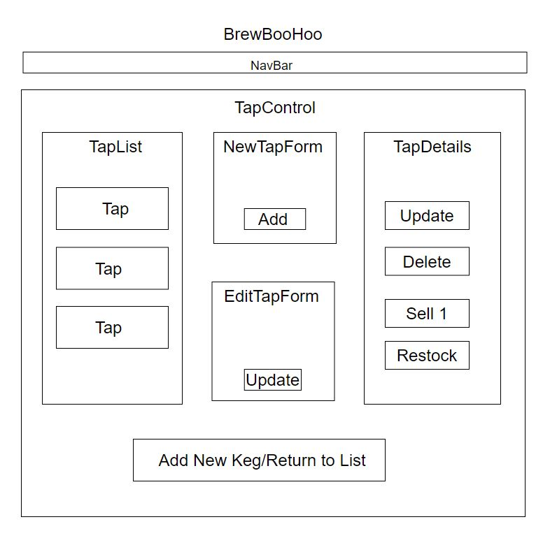

# BrewBooHoo: Epicodus Tap-Room Project 
### By Andrew Giang
---
## Project Description
##### This project is a web application can track their a bar and their product list. As a user, you can: 
* see a list/menu of all available kegs
* submit a form to add a new keg to a list
* click on a keg to see its detail page
* see how many pints are left in a keg
* click a button to sell a pint of a specific product
* edit a keg's properties after entering them just in case I make a mistake
* delete a keg
---
## Component Diagram

---
## Tech Stack
1. React
2. HTML5+CSS3
2. JavaScript/ES2018+
4. Bootstrap
8. NPM
---
### Installation Instructions
1. clone the repository to your local drive
2. Enter downloaded directory
3. Install dependencies with `npm install`
4. Then to run this project locally, use the npm dev command `npm start`

---
### Known Issues:
* NO KNOWN ISSUES
---

## License

* _[MIT](https://opensource.org/licenses/MIT)_